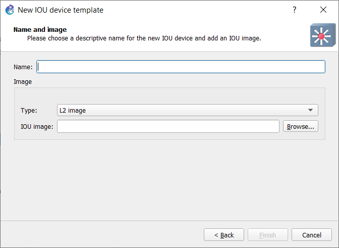
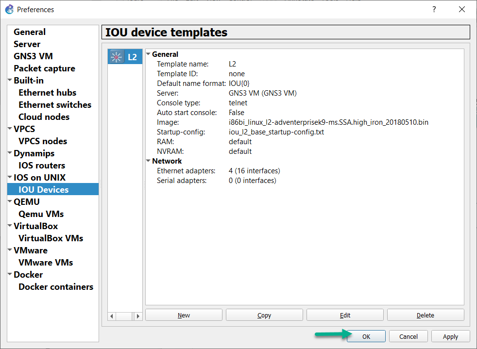

IOU is IOS on Unix (Solaris, if you want to be specific). It's a version of IOS compiled to run on workstations. It's faster and lighter than emulation. Cisco transitioned to IOL images, which are x86-64 compatible versions of IOS that natively run in Linux. Since everyone and their kid brother still refers to IOL images as “IOU”, that convention is used for the remainder of this document.

Please note that GNS3 can not provide you images or licences.

## GNS3 VM
Since IOU images can be run in Linux, you will need to use a Linux VM to use it when running GNS3.  For Windows/Mac OSX users, the GNS3 VM is available. Use of the GNS3 VM is optional for users running GNS3 natively in Linux.

First, you need to configure the GNS3 VM. so read the documentation [here](../installation/download-gns3-vm).

### License
You will need a license for your GNS3 VM to run IOU. This licence is provided by Cisco. We called this license file iourc

The content of the licence file will be like this:
```
[license]
gns3vm = 42aa42bb42cc84ff;
```

:::caution
This is not a real licence! You must provide your licence. Only Cisco can provide you an IOU license, so don’t bother asking for it (or the images) on the GNS3 user forum!
:::

Save this file somewhere on your disk.  
In the GNS3 GUI, click **Edit -> Preferences -> IOS on UNIX**:


Click **Browse** to select your IOU license file, then click **OK** to proceed:


### Add the images:
In the GNS3 Preferences menu, select IOU Devices, then click New:


As this article uses the GNS3 VM in Windows 10, that’s the only available option in the **Server type** window, so click **Next>** to proceed:


(Linux users can run IOU images via the local server. If a remote server has been set up, then that optional will become available)

Next, you will be prompted to:
1. Give the device a name
2. Select an image type.  (L2 image and L3 image are selectable in the dropdown menu)
3. Browse your filesystem to select the IOU image you want to import.



In the below example, an **L2 IOU image** was used, the **type**: was left set to **“L2 image”**, and it was given the name **“L2”**:


Click **Finish** to complete the import process:


Your device is now listed among the **IOU device templates**:



Your IOU device will be selectable in the **Switches** or **Routers** device lists, depending on whether an L2 or L3 IOU image was used.

(both types appear in the **All Devices** list)

There are also IOU appliance templates available in the [Appliances](https://www.gns3.com/marketplace/appliances) section of the GNS3 Marketplace to atuomate this process. Downloading .gns3a appliance templates, and using the Import Appliance wizard to import appliances, are covered in these articles:

- [Install an appliance from the GNS3 Marketplace](../using-gns3/install-from-marketplace)
- [Import GNS3 appliance](../using-gns3/import-gns3-appliance)

You will still need to provide your own IOU license file, and images, regardless of the import method used.
