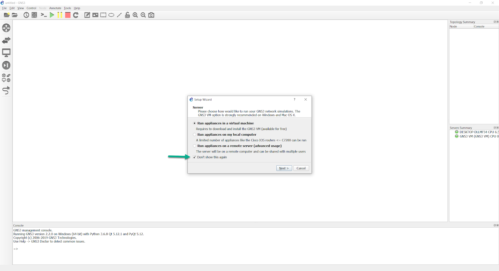
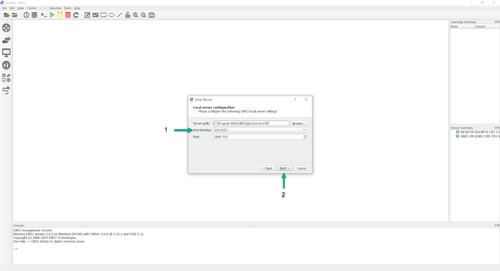
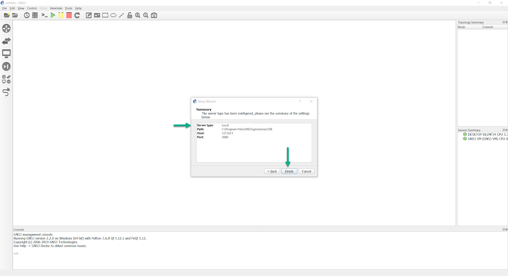
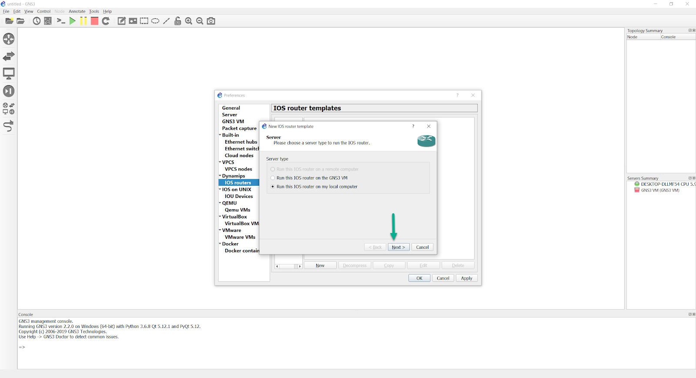
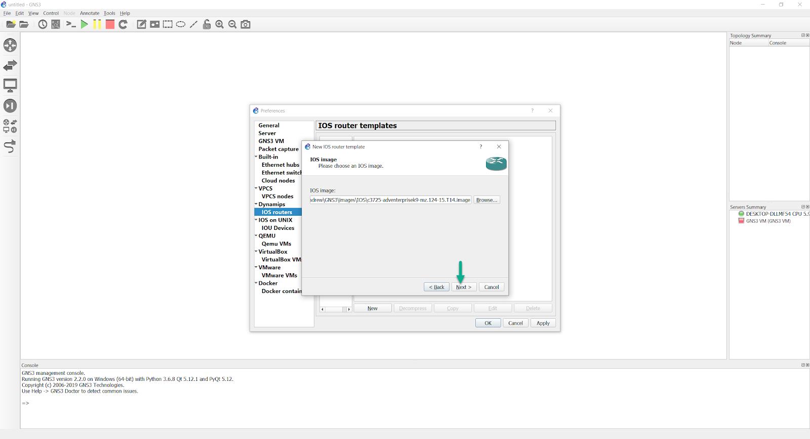
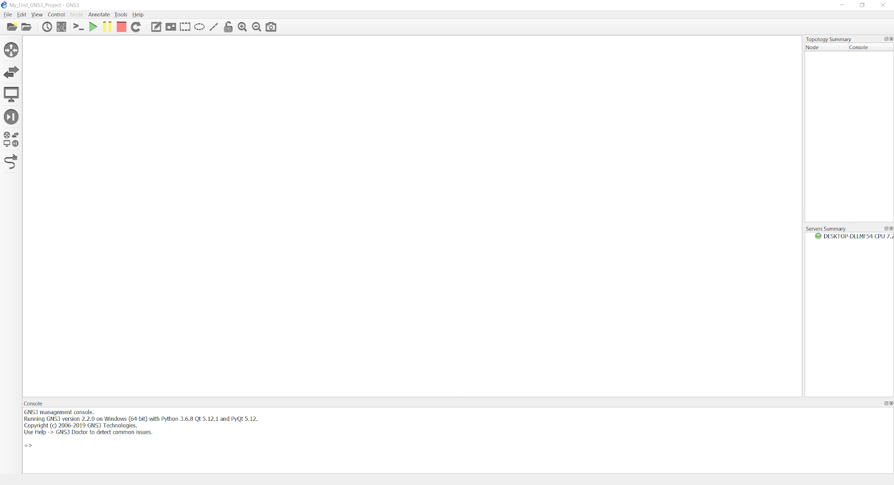

## Introduction
This document explains how use the GNS3 Setup Wizard to configure a GNS3 local server. This is also called a local Dynamips implementation of GNS3.

:::important
If you want to use IOSvL2, IOU, IOSv, IOS-XRv, ASAv or want to create more complex topologies, the GNS3 VM is recommended for Windows and Mac OS implementations (it’s optional for Linux users).    
:::

Video: https://www.youtube.com/watch?v=C9JEq6CBaJo

## Overview
The GNS3 Setup Wizard is displayed when GNS3 starts up for the first time. This provides an easy way to initially configure GNS3 options:

## Manually starting the Setup Wizard
You can also manually start the Setup Wizard at any time by clicking **‘Help’** and then **‘Setup Wizard’** in the GNS3 GUI:

## Disable the Setup Wizard
As of the GNS3 2.2.0 release, the default is for **“Don’t show this again”** on the first Setup Wizard screen to be selected.

With previous GNS3 releases (like the 2.1.x series), this was not the case.   

## Using the GNS3 Setup Wizard
Select **"Run appliances on my local computer"** in the Wizard and click **'Next >'**:

:::important
This guide explains the Local server set up. For the Local GNS3 VM guide [click here](setup-gns3-vm)
:::

For Windows and Mac OSX users, running appliances on your local computer will limit you to only running certain devices, like the legacy IOS images that Dynamips supports (see here), VPCS, and the other devices that GNS3 includes in the base installation (like VPCS, the built-in hub and ethernet switches, etc…)

This is not the case with users running GNS3 in Linux. GNS3 can run IOS images, QEMU/KVM VMs, and Docker containers natively, so they should select the local server optional, unless they are optionally using the GNS3 VM instead.

The next screen shows the server path (the directory gns3server.exe is stored in locally), the Host binding, and the port GNS3 will use to connect to gns3server.exe. Alter these settings to suit your local environment, and click **'Next'**:

:::note
While there is a lengthy dropdown list of possible host binding addresses, opting for the 127.0.0.1 local loopback address tends to be the most trouble-free option.  
:::

After clicking **‘Next’**, you should get a validation screen:

Some anti-virus suites will block the connection attempt, so you may need to create exception/whitelist entries for the gns3server, ubridge, and dynamips executables in order for the connection validation to be successful.

Performing that operation varies between antivirus suites, so you’ll need to refer to their relevant documentation to learn how to do this.  

By default, gns3server, ubridge, and dynamips should already be allowed through the Windows firewall. It’s worth double checking to ensure that’s the case.

Once the connection to the local server has been validated, clicking **'Next'** will show you a brief summary:

(notice that the Server Type lists “Local”, in the above image)

Click **'Finish'**

With recent releases of GNS3, devices are typically installed using the Import Appliance wizard (File->Import Appliance).  The appropriate appliance templates for the devices you wish to use, are available in the GNS3 Marketplace.  However, this article will discuss adding and configuring a supported IOS image manually, as the articles here and here discuss appliance templates, and using the Import Appliance Wizard to automate installation of images/VMs/docker containers.

In the GNS3 GUI, click **Edit > Preferences**, to open the preferences menu.

In the preferences menu, select **'IOS Routers and New'**, to begin the process of importing an image.

You’ll be prompted which server you’d like to run the image with, but everything except **'Run the IOS router on my local computer'** should be greyed out.

(the option to run the image via the GNS3 VM isn’t greyed out in the above picture, since the GNS3 VM had previously been set up on this PC)

On the next screen, click **'Browse'** to import a supported IOS image:

Browse to the folder where you have stored your Cisco IOS images, select the image,  and click **'Open'**:

:::important
Some vendors provide images of their systems for free. Others do not,  and you are required to provide your own images. The GNS3 team are unable to legally provide Cisco IOS images to anyone.
:::

GNS3 can decompress IOS images to allow for quicker booting of routers in your  GNS3 topologies. This is recommended for a better user experience. Click **'Yes'** to decompress the image:

The directory where the decompressed image is stored is displayed. Click **'Next'** to continue the setup:  

The **Name and platform** window displays. Confirm the Platform selection, and configure the router Name. Click **'Next'** :  

A Default RAM setting is displayed. It is important that you check your Router's minimum memory requirements using the Cisco website. Click the **'Check for minimum and maximum RAM requirement'** option:

The **Cisco Feature Navigator** is opened in your default web browser. Select **Image Name** and enter the name of the image you are using:  

Click **Search for Image(s)**:

The minimum DRAM requirements for the IOS are displayed. Note the value for your IOS image:

Set the Default RAM value to the value recommended by the Cisco Feature Navigator (yours may be different to the screenshot) and click **'Next'**:    

Select your preferred Network adapters. This is device dependant.

In this example both Ethernet Serial interfaces will be added to the router. Once selected, click **'Next'**:

The c3725 IOS images will have the GT96100-FE dual Fast Ethernet adapter installed in slot 0 by default, and you can add extra adapters in slots 1 and 2.  The types of adapters, and how many slots you are allowed to add will depend on the IOS image in use.

Once you have configured the network adapters, click **'Next'** to add WIC adapters (again, this is IOS image dependent):

When you have added WIC adapters (if available), click **'Next >'**

It is important for optimum GNS3 performance that an **Idle-PC** value be  selected. Occasionally, some images will already display an **Idle-PC** value:

If a green Idle-PC value is NOT shown then click the **'Idle-PC finder'** button to find an Idle-PC value:

If you selected the **'Idle-PC finder'** button (only necessary if no value was detected automatically), GNS3 will calculate a value:

(note, this may take a few moments, depending on the speed of your PC)
An Idle-PC value is displayed. Click **'OK'** to complete:

:::important
If no Idle-PC value is displayed, try clicking the Idle-PC finder button again. You may also need to reboot your computer and try again is no value is found.  It’s incredibly important to have an idle-pc value when using supported IOS images. Without this value, DynaMIPS can’t prevent an instance of an IOS image from consuming 100% of a CPU core or hardware thread (in the case of CPUs capable of hyperthreading).
:::

Click **'Finish'** to complete the GNS3 Setup Wizard:     

In this instance, the IDLE PC value was already specified, according to the value listed in this page, so you can click **'Finish'**, instead of going through the IDLE-PC finder process.

The **Preferences** window displays showing the settings you have configured through the Setup Wizard. Click **'OK'** to complete the process:

(notice that the name of your PC will be listed next to ‘Server’ in the shown settings. That is further indication that this router will be run via the local computer, as opposed to the GNS3 VM)

The **New Project** Window displays. Give your new Project a **Name** and click **'OK'**:

The GNS3 workspace displays:

**Congratulations!** You are now ready to create your first GNS3 topologies. Click here to create a basic GNS3 topologies CHECKLINK
