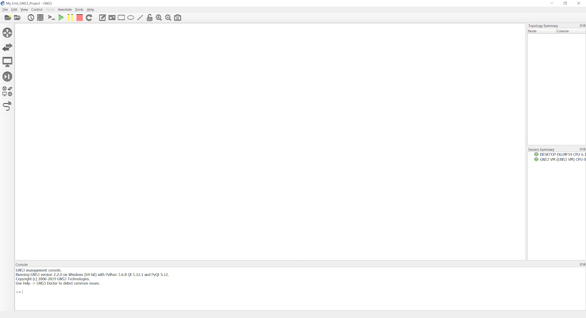
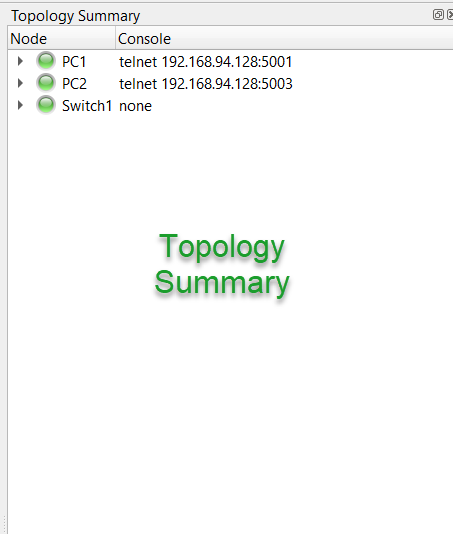
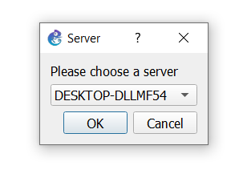
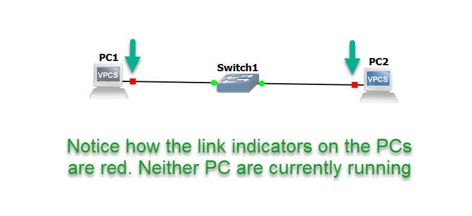
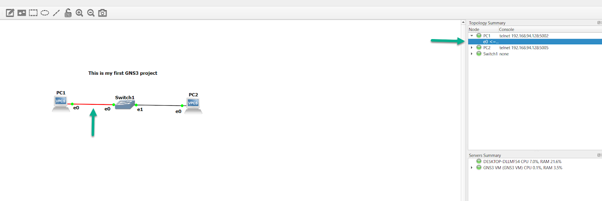
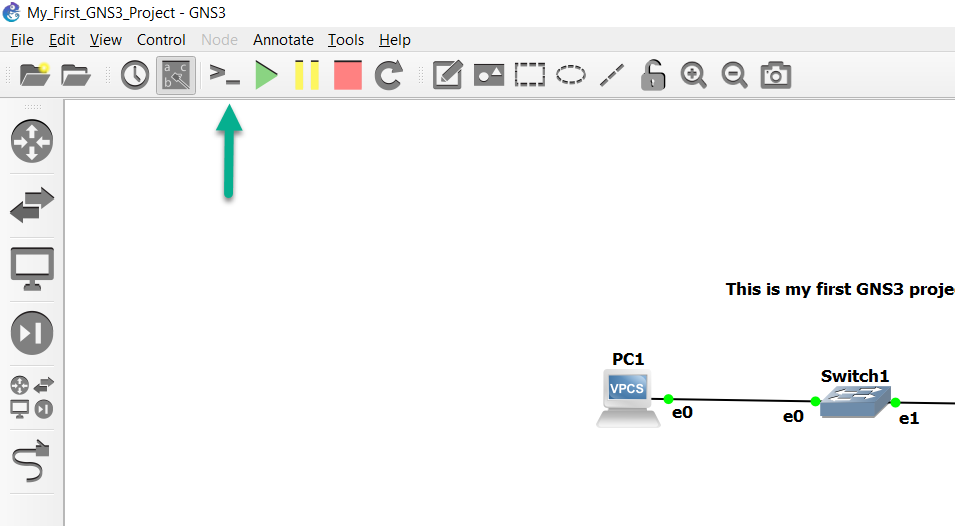

## Introduction
This document explains how to configure a simple GNS3 topology which consists of two Virtual PC Simulator (VPCS) devices.This is a simple way to test your GNS3 installation and build your first topology.

VPCS PCs are installed by default as part of the GNS3 installation on Windows and Mac OS.

:::note
This document assumes that you already have GNS3 installed.  
:::

- Video: https://www.youtube.com/watch?v=C9JEq6CBaJo&feature=emb_title

## Get to know your GNS3 Graphical User Interface (GUI)
### On first start up

When you first start GNS3 2.2.0, create a new project by clicking **File->New_blank_project**


Name the project as desired and then click **OK**:


### Screen Layout

The following figure shows a screenshot of the GNS graphical user interface which we will quickly discuss so you know some of the terminology used:



### GNS3 Workspace

The GNS3 workspace is the area of GNS3 where you create topologies by adding devices and links:


### GNS3 Toolbar

The GNS3 toolbar is found at the top of the GNS3 GUI and contains groups of icons that allow you to easily perform common tasks:


The toolbar groups icons into specific functions or features. This gives you a simple way of getting things done.

### Devices Toolbar

The devices toolbar allows you to add devices to your network topology. You do this by dragging devices from the Toolbar to the GNS3 workspace (explained below).


The devices toolbar is grouped into different types by default:

| Tool | Name |
| ---- | ---- |
|  | Routers |
|  | Switches |
|  | End Devices |
|  | Security Devices |
|  | All Devices |
|  | Add a link |

You will find both simulated devices as well as emulated devices in the various device groupings.

The Topology Summary pane is located towards the upper-right side of the GNS3 GUI, and will list the nodes that are in the current topology:



As you’ll see shortly, this pane not only lists the current topology devices, but also their state (on/off), as well as list the interface connections between the various nodes.

The Server Summary pane shows the Local Server status, as well as that of the GNS3-VM (if in use):


In this instance, the both the local server (the name of the PC) and the GNS3-VM are currently up and running.  The local server’s resource usage includes more than just what GNS3 itself is using (if you are heavily multitasking while running GNS3, you’ll see that reflected in the resource summary), while the resource usage for the GNS3-VM is only showing what *it* is currently using.

Lastly, the GNS3 Console is at the bottom of the GNS3 GUI:


Errors GNS3 encounters while executing tasks will be written here, and GNS3 mods may ask you to run debug commands here, to better isolate an issue you may be encountering.

## Create your Topology

To create a new GNS3 topology, click the **Browse End Devices** button on the **Devices Toolbar**:


The toolbar will expand to show available devices of that type. In this example, the VPCS device is one of the available types:


To create your first GNS3 topology, first click on **Switches** in the Devices Toolbar.  Drag and drop the built-in ethernet switch to the GNS3 **Workspace** as shown below. An instance of the device called **Ethernetswitch-1** will now be available in the topology.


Next, click on **End devices** in the **Devices Toolbar**, and drag and drop an instance of VPCS (a simple PC simulator) into the **Workspace**, which will be called PC-1:


:::note
If you already have the GNS-VM imported and configured, you’ll be prompted to select whether you wish to run the VPCS node via the local server or the GNS3-VM. Select whichever you wish, since VPCS can run in either.
:::



The above image is listing the name of the PC, indicating that you’d like to run this node via the local server.


The above image lists “GNS3 VM”, indicating you’d like to run this node via the GNS3 VM

Drag and drop that same VPCS node again into the **Workspace**, which will add a second node called “PC-2”, so that you have the resulting devices in your topology:


To collapse the **Browse End Devices** toolbar, either click the **Browse End Devices** button again, or click the X shown below:


Notice that the Topology Summary pane has now changed, to reflect that we have three nodes in our workspace:  Ethernetswitch-1, PC-1, and PC-2:


Click the **Add a Link** button to start adding links to your topology. The mouse cursor will change to indicate that links can be added:


Click on **PC-1** in your topology to display available interfaces. In this example, only Ethernet0 is available (this is device dependent):


Click Ethernet0 on PC-1, and then left-click on Ethernetswitch-1:


Select Ethernet0 on Ethernetswitch-1 to complete the connection. To create a link between Ethernetswitch-1 and PC-2, you can click on either node, select an interface, click on the other node, and make that connection:


Click the **Add a Link** button to stop adding links. The mouse cursor will change back to normal to indicate that you have stopped adding links.

The first thing you’ll notice is that the indicator symbols next to the devices are red. The means the devices are currently powered off:



:::note
Devices that are suspended will have yellow indicators. Devices that are powered on will have green indicators even if their interfaces are in the down/down state (such as router/switch interfaces that have been administratively shut).  You’ll need to double check the running config of any routers or switches to ensure that their interfaces have been manually enabled.

This powered on/powered off/suspended state is also reflected in the **Topology_Summary**
:::


It’s helpful to toggle on the interface names, as well as add notes to your topology, to make it easier to see which interfaces are connected between devices, as well as adding notes such as subnets/ip addressing, listing OSPF areas or BGP autonomous Systems, and so forth.  These two buttons on the toolbar will enable you to toggle interface names on/off, and add notes:


Below is an example of this in use. You can see that PC-1’s e0 interface is connected to e0 of Ethernetswitch-1, and e0 of PC-2 is connected to Ethernetswitch-1’s e1 interface, along with a simple note:


The Green “Play” button on the **GNS3 Toolbar** will power on all devices in the topology, while the Yellow “Pause” button will suspend them, and the Red “Stop” button powers everything in the topology down:


This is also reflected in the **Topology Summary**.



You are now ready to configure your devices. Click the **Console connect to all devices** button on the **GNS3 Toolbar** to open a connection to every device in the topology:



By default, GNS3 will use Solar-PuTTY in Windows, as it’s installed as part of the GNS3 installation process, but you can configure GNS3 to use other terminal emulators (such as SecureCRT or Gnome-Term):


Let’s assign some IP addresses to PC-1 and PC-2, and ensure they can communicate with one another:

```
PC-1> ip 10.1.1.1 255.255.255.0
Checking for duplicate address...
PC1 : 10.1.1.1 255.255.255.0
PC-1>
PC-2> ip 10.1.1.2 255.255.255.0
Checking for duplicate address...
PC1 : 10.1.1.2 255.255.255.0
PC-2>
```

Can PC-1 ping PC-2?

```
PC-1> ping 10.1.1.2
84 bytes from 10.1.1.2 icmp_seq=1 ttl=64 time=0.985 ms
84 bytes from 10.1.1.2 icmp_seq=2 ttl=64 time=0.982 ms
84 bytes from 10.1.1.2 icmp_seq=3 ttl=64 time=0.000 ms
84 bytes from 10.1.1.2 icmp_seq=4 ttl=64 time=0.981 ms
84 bytes from 10.1.1.2 icmp_seq=5 ttl=64 time=0.982 ms
```

Yes, it can. Now let’s ping PC-1 from PC-2:

```
PC-2> ping 10.1.1.1
84 bytes from 10.1.1.1 icmp_seq=1 ttl=64 time=0.980 ms
84 bytes from 10.1.1.1 icmp_seq=2 ttl=64 time=0.982 ms
84 bytes from 10.1.1.1 icmp_seq=3 ttl=64 time=0.997 ms
84 bytes from 10.1.1.1 icmp_seq=4 ttl=64 time=1.029 ms
84 bytes from 10.1.1.1 icmp_seq=5 ttl=64 time=0.996 ms
```

That succeeds as well.

Now let’s add a third PC to our topology:


Instead of clicking the large green Play button on the **Toolbar**, we can right-click on PC-3, and select **Start** to power it on:


We’ll do the same thing a second time, but we’ll select **Console**, since we already have console tabs open for the other two devices:


That will open a new third tab in Solar-Putty for us:


(if we’d clicked the Console button on the Toolbar, it would’ve opened tabs for all three devices, even though we already had two of them open already for PC-1 and PC-2).

Let’s assign an IP address to PC-3, and see if all three PCs can ping one another:

```
PC-3> ip 10.1.1.3 255.255.255.0
Checking for duplicate address...
PC1 : 10.1.1.3 255.255.255.0
PC-3>
```

Can PC-1 ping PC-2 and PC-3?

```
PC-1> ping 10.1.1.2
84 bytes from 10.1.1.2 icmp_seq=1 ttl=64 time=0.985 ms
84 bytes from 10.1.1.2 icmp_seq=2 ttl=64 time=0.982 ms
84 bytes from 10.1.1.2 icmp_seq=3 ttl=64 time=0.000 ms
84 bytes from 10.1.1.2 icmp_seq=4 ttl=64 time=0.981 ms
84 bytes from 10.1.1.2 icmp_seq=5 ttl=64 time=0.982 ms
PC-1> ping 10.1.1.3
84 bytes from 10.1.1.3 icmp_seq=1 ttl=64 time=0.000 ms
84 bytes from 10.1.1.3 icmp_seq=2 ttl=64 time=1.001 ms
84 bytes from 10.1.1.3 icmp_seq=3 ttl=64 time=0.982 ms
84 bytes from 10.1.1.3 icmp_seq=4 ttl=64 time=0.984 ms
84 bytes from 10.1.1.3 icmp_seq=5 ttl=64 time=0.988 ms
```

Yes it can. Can PC-2 ping PC-1 and PC-3?

```
PC-2> ping 10.1.1.1
84 bytes from 10.1.1.1 icmp_seq=1 ttl=64 time=0.980 ms
84 bytes from 10.1.1.1 icmp_seq=2 ttl=64 time=0.982 ms
84 bytes from 10.1.1.1 icmp_seq=3 ttl=64 time=0.997 ms
84 bytes from 10.1.1.1 icmp_seq=4 ttl=64 time=1.029 ms
84 bytes from 10.1.1.1 icmp_seq=5 ttl=64 time=0.996 ms
PC-2> ping 10.1.1.3
84 bytes from 10.1.1.3 icmp_seq=1 ttl=64 time=0.999 ms
84 bytes from 10.1.1.3 icmp_seq=2 ttl=64 time=0.985 ms
84 bytes from 10.1.1.3 icmp_seq=3 ttl=64 time=0.000 ms
84 bytes from 10.1.1.3 icmp_seq=4 ttl=64 time=0.980 ms
84 bytes from 10.1.1.3 icmp_seq=5 ttl=64 time=0.000 ms
```

It also can. Since both PC-1 and PC-2 can ping PC-3, it’s safe to assume it can ping both of them as well, but we’ll run the test anyway, just to be safe:

```
PC-3> ping 10.1.1.1
84 bytes from 10.1.1.1 icmp_seq=1 ttl=64 time=0.999 ms
84 bytes from 10.1.1.1 icmp_seq=2 ttl=64 time=0.000 ms
84 bytes from 10.1.1.1 icmp_seq=3 ttl=64 time=0.980 ms
84 bytes from 10.1.1.1 icmp_seq=4 ttl=64 time=0.997 ms
84 bytes from 10.1.1.1 icmp_seq=5 ttl=64 time=0.000 ms
PC-3> ping 10.1.1.2
84 bytes from 10.1.1.2 icmp_seq=1 ttl=64 time=0.999 ms
84 bytes from 10.1.1.2 icmp_seq=2 ttl=64 time=0.988 ms
84 bytes from 10.1.1.2 icmp_seq=3 ttl=64 time=0.999 ms
84 bytes from 10.1.1.2 icmp_seq=4 ttl=64 time=0.981 ms
84 bytes from 10.1.1.2 icmp_seq=5 ttl=64 time=0.980 ms
```

Good. Everything works as expected.  Now, since GNS3 doesn’t save the configurations of these by default, it’s a good idea to go ahead and manually do so ourselves, so that if we reload this project at a later date, the PCs will still be configured the way we left them:

```
PC-1> save
Saving startup configuration to startup.vpc
.  done
PC-1>
PC-2> save
Saving startup configuration to startup.vpc
.  done
PC-2>
PC-3> save
Saving startup configuration to startup.vpc
.  done
PC-3>
```

(If you’d like to see what other commands are available in VPCS, you can enter ‘?’ (minus the quotes) to see what else VPCS supports).  

**Congratulations!** You have configured a basic GNS3 topology. From here on, you can create much more complex topologies and test and learn various technologies such as OSPF, EIGRP, BGP, STP and many others.
