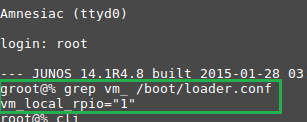
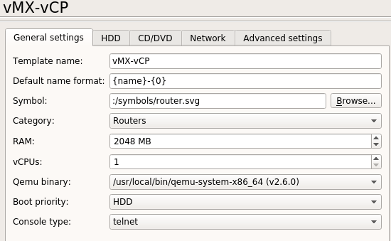
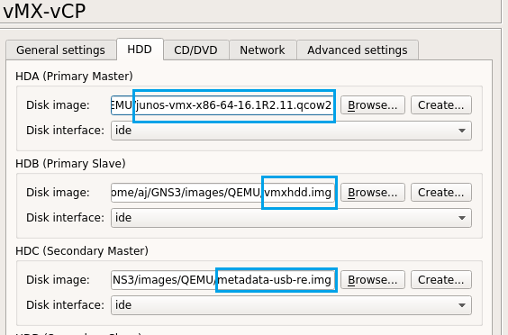
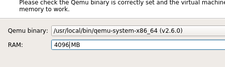
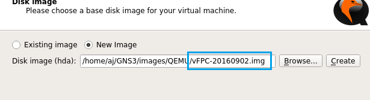
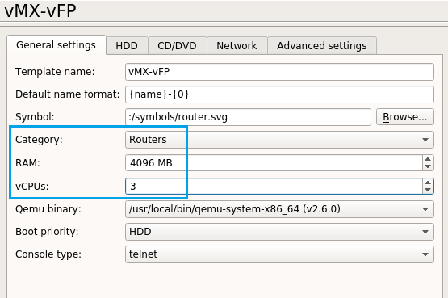
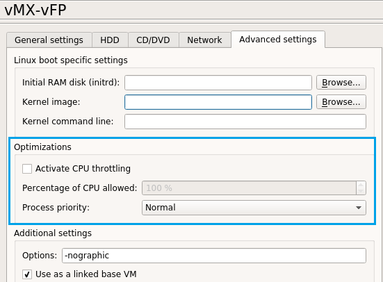
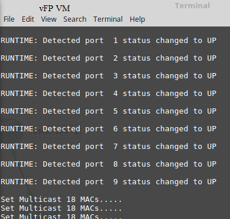
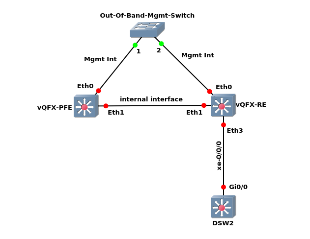

:::caution
Important edit - see bottom of the document!
:::

## Legacy VMX (the single-VM pre-release versions)

These single-VM versions of vMX include 14.1R1.10, 14.1R3.5, and 14.1R4.8.

First, click **Edit->Qemu VMs->New** in GNS3.


I just called it “vMX”, but you could include the version number in the name, as well.


Next, assign it 1GB of RAM, and select your qemu binary. I happen to be using v2.6.0 in Linux, but the GNS3-VM will have v2.5.0.


Next, choose your image file. By default, these will be called ```“jinstall-vmx-<version>-domesting.img”```.


When you edit the newly created VM, set assign it to the Routers category, and make sure it’s set to use 1GB RAM, 1 “vCPU”, and telnet.


For the network settings, I’ve assigned it 12 adapters. Here’s why:

- Eth0 = the management interface (fxp0)
- Eth1 = internal interface (unusable to us)
- Eth2 = ge-0/0/0
- Eth3 = ge-0/0/1
- Eth4 = ge-0/0/2
- …
- Eth11 = ge-0/0/9

Thus, if you wanted to connect ge-0/0/0 on two vMX instances to each other, you’d connect Eth2 on both VMs to each other.

Here are what your final settings should look like, in GNS3:


When you start up one of these legacy images, the login is “root” with no password.  Now, before I proceed, there something you need to be aware of:  Not all the pre-release single-VM images of vMX had the virtual FP enabled.  Here is what you WANT to see, after the vMX instance loads:



If that statement isn’t there, don’t worry. You can manually enable it by running this:
```
root@%  echo ‘vm_local_rpio=”1”’ >> /boot/loader.conf
```
Reboot the image, and then it will be enabled.

Something else you know:  Even though the legacy vMX image boots up rather quickly, the virtual FP part of it does NOT. You really need to give it an extra 2-3 minutes, after you see the login prompt, so that everything fully loads up. Here is what you’ll see, if you do not wait:


You may think that looks fine, but the virtual PIC 0 is missing, which means none of the gigabit ethernet interfaces will ever be present.  Once you wait an extra 2-3 minutes, here’s the output we really want to see:


Notice that virtual PIC 0 is Online, and we can see that the 10 ge-0/0/x interfaces I configured the VM to use, are present and “up/up”. That means we can start configuring the system.  Type “edit” (without the quotes) to get into configuration mode.  Now, since we didn’t have a root password when we logged in, the first step we should do is create one. If we don’t, then the commit process will never work, so we’ll be unable to commit our configuration changes.

In the below example, I set a root system password, configured ge-0/0/0 to use an IPv4 address, and successfully committed the changes:


That’s really all it takes to get the legacy single-VM versions of vMX to run via GNS3.  Since they are far more lightweight (resource-wise) than the split VM public releases of vMX, you might want to consider tracking these down. Sure, they are missing features, but they’re perfect if you want to dip your toes in Juniper’s “water”, and you can easily use multiple instances in a topology, like this:


## Importing the split-VM public releases/trials of VMX
With the public releases of vMX, Juniper split it up into two VMs: the virtual control-plane (vCP), and the virtual forwarding-plane (vFP). This means we’ll need to create two VMs in GNS3, and connect them together, in order to run a vMX “instance”.   The way to do this, is to request access to the 60-day trial download from Juniper, and download the KVM version.  The reason we’re after the KVM version, is that we’ll need 4 files out of the “images” folder, in order to create and run the VMs. I’ve successfully been able to do this with the 16.1R2.11 and 16.1R3.10 versions.    

When you download the KVM version of vMX, it will come as a roughly 3GB .tgz file. Once you extract that archive, here’s what you’ll find in the resulting folder:


All of these are necessary, if you wanted to run vMX on an Ubuntu server via KVM, but since we’ll be using this with GNS3, we only need 4 files from the images folder:


If you have no intention of running vMX on an Ubuntu server, feel free to delete everything except the files I’ve highlighted. Just be aware that Juniper changes the filenames of the vFPC .img and the vmx .qcow2 file, with the different versions. They may even require we use a different metadata-usb-re.img in later releases.

First, let’s create the vCP virtual machine, so we can run it via Qemu:


I chose to name the VMs “vMX-vCP” and vMX-vFP”, but you can call them whatever you wish.


We need to allocate vCP at least 2GB RAM.


Choose the junos .qcow2 file from the image folder to be used as HDA.  Click finish, and we’ll edit the vMX-vCP vm:



Assign vMX-vCP to the Router category, confirm it’s been assigned 2GB RAM, 1 vCPU, and that we’ll use Telnet. Next, we need to click on the HDD tab, since we must add two more files:



We MUST add vmxhdd.img as HDB, and metadata-usb-re.img as HDC.  Failing to add these, or adding them in the wrong order, will result in this VM either not loading at all, or to load up with issues.  Click on the Network Tab next.


The vMX-vCP VM only needs two adapters. One to connect to an out-of-band mgmt switch, and the other to connect to the vMX-vFP VM as our internal interface.  I’ve see people name the first port “fxp0”, since that’s what the mgmt port is called, and then use em{port1} so that the second interface is called “em1”, which is the name of the internal interface.  You can leave these set as Intel GigE interfaces.  Click finish, and here are what your final settings for the vCP VM should look like:


Next, we need to create the vFP VM:


Again, I just called this the unimaginative name “vMX-vFP”, but you can call it whatever you want.



Yes, you actually do need to assign the vFP virtual machine 4GB RAM. You could even go as far as assigning it 6GB RAM.



We assign the ```vFPC-<date>.img``` file to be HDA  (we don’t currently need to worry about adding extra disk images for the vFP vm at this time). Go back, and edit the newly created “vMX-vFP” vm, and we’ll make some setting changes:



Set this vm to be part of the Router group, confirm that it’s been assigned 4GB RAM, assign it THREE (3) vCPUs, and that we’ll be using telnet. Next, click on the Network tab:


I have seen folks say not to use more than 9 interfaces, but with the 16.x series, I’ve had pretty good luck with 12.   The first port name was set to “ext”, since that will also connect to the OOB mgmt switch, and the name format was set to Eth{port1}, since Eth1 will be part of our internal interface, and connect to “em1” of the vCP vm.   Now, notice that I set the interface type to “virtio-net-pci”. This is very important. When I tried leaving it set to Intel e1000, it would generate lots of error on boot (and besides, you use those adapter types, when running vMX via KVM on an Ubuntu server any way, so it makes sense).  

Now, this next part is optional, but you can limit the amount of CPU time that gets allocated to the vFP vm via the Advanced Settings tab:



I haven’t tried this part yet, but I have seen people recommend using this option for both the vFP vm of vMX, as well as the vPFE vm of vQFX, so they don’t peg out the vCPUs they’ve been assigned.

Here are what the final settings of your vMX-vFP vm should look like:


Here’s an example topology, to show you how to connect the two VMs together, as well as connect other VMs to our vMX “device”:


I used a generic ethernet switch to stand in for an actual OOB mgmt switch.  Notice that “fxp0” of the vCP vm and “ext” of the vFP vm connect to it.  Also note that “em1” of vCP and Eth1 of vFP connect to each other, replicating the internal interface found in physical MX devices.

Just like with our legacy single-VM versions of vMX, Eth2 is our ge-0/0/0 interface, Eth3 is ge-0/0/1, and so on… All of our other topology devices will connect to the vFP vm, not the vCP vm.

Now, let’s boot the vCP and vFP VMs up!  I won’t sugar coat this, they take a while to load up. The vFP vm loads up first, but only to a point. It will sit and wait on the vCP vm to fully load up, before it can fully load up itself.  Here’s a visual hint that the vFP is fully loaded:



Once you see those messages, the vFP vm is loaded up. You can even log into it, by using “root/root”, but you’ll be dropped into Wind River Linux, and not Junos


Personally, I wouldn’t really recommend tinkering around in Linux directly. Instead, I’d open up the PFE shell via the vCP, using this command:

```
> start shell pfe network fpc0
```

By using this, you can troubleshoot the PFE (in vMX, they actually only virtualized the Lookup (LU) part of the Trio chipset. The other functional blocks were recreated by Juniper, using the software packet processing abilities of Linux, and the DPDK libraries/Framework from Intel (for certain features)

There’s a free Day One book (you just need a free J-net account) called “This Week: An Expert Packet Walkthrough on the MX 3D Series” that will show you more PFE shell commands. [Here’s a direct link to the .pdf file](https://www.www.juniper.net/us/en/training/jnbooks/day-one/networking-technologies-series/packet-walkthrough-mx-series/).

If you want to read more about this (and MX in general), you can check out the [MX series 2nd Edition book from O’Reilly](https://www.amazon.com/Juniper-MX-Comprehensive-Guide-Technologies/dp/1491932724) (you can also read it on Safari Online if you have an account there).

Now, when you log into the vCP vm, it’s “root” with no password, and you’ll be dropped into Junos, just like before:


You can see our virtual PIC 0 is Online, and our 10 ge-0/0/x interfaces are “up/up”, but notice that like with vSRX, the virtual PIC 0 doesn’t show how many interfaces that PIC would provide. Weird.

Any way, once you’ve reached this point, you can administer it, just like a single-VM version of vMX. [On this page](https://www.juniper.net/us/en/dm/free-vmx-trial/), there is a link to an evaluation license you can add to vMX (there’s also a link that shows how to do it). It gives you 60 days to try out a premium license with 50Mbps throughput. You can also use it without the license, but you’re limited to the base license and 1Mbps.

Something I was unable to get working with vMX and GNS3, was having two routing engines running at the same time. It’s entirely possible it’ll work if you build the KVM version of vMX on a dedicated server, but trying to use the metadata-usb-re0 and re1 images as hdc and hdd, respectively still only resulted in vMX using a single routing engine. That means no Virtual Chassis, NSR, or ISSU for us, in a GNS3 topology.  

## Importing the pre-releases VQFX trial into GNS3

This is fairly simple to import into GNS3, even though it is a split VM, just like vMX. There are only currently two versions available:  VMware and Vagrant.  When I requested access to the trial downloads, here are the files Juniper has available:


We only need two files, I just wanted to show that they have two .vmdk files for VMware (we can use them with Qemu/KVM), as well as the same two files, but as Vagrant .box files for Virtualbox.

As you can glean from the filenames, these are virtual versions of Juniper QFX 10000 series switches  (vQFX thinks it has a single QFX10002-36Q linecard installed).  These are high-end switches aimed more at Spine, Core, IP Exchange, Provider Edge, or any other role that calls for high-end switches.  Like vMX and physical MX routers, Junos actually runs as a guest OS via KVM, while the host OS is Wind River’s Yocto Linux.

Let’s get started by creating the Routing Engine VM for Qemu:


Again, I used a pretty unimaginative name for it.


I allocated it 1GB RAM, but I’ve heard from a user that he only gave it 512MB RAM, when he runs it in the GNS3-VM. I can confirm that it boots with that amount, but I haven’t really stressed the VMs yet, so I don’t know if it’s going to cause an issue down the road.


Next, select the vqfx10k-re-15.1X53-D60  file. I converted the .vmdk files into .qcow2 disk images, but you can run the .vmdk files directly, without needing this extra step.


When you edit this newly created VM, add it to the Switches category, and assign it 2 vCPUs. Leave console type as telnet. Click the Network tab next.


Unlike with vMX, we’ll actually connect our other topology devices to the Routing Engine (RE)  VM, instead of the Packet Forwarding Engine (PFE) VM, which is why I assigned it 15 interfaces.

Just like with vMX, Eth0 will connect to an OOB mgmt switch, Eth1 will connect to Eth1 of the PFE VM as an internal interface, and for some reason, we can’t use Eth2 (not sure of why).  That means our interface scheme now looks like this:

Eth3 = xe-0/0/0
Eth4 = xe-0/0/1
Eth5 = xe-0/0/2
…
Eth14 = xe-0/0/11

Once finished, your final VM settings should resemble this:


Now we create the vPFE VM:


I only assigned the PFE VM 1GB RAM, as well.


Select the vqfx10k-pfe-20160609-2 file. Again, I had converted the .vmdk file to a .qcow2, but you could likely skip that step, and still run this fine.

Now to edit the newly create vQFX-PFE vm:


Assign it to the Switches category, double-check it has 1GB RAM and 1 vCPU, and that the console type is telnet. Next, click the Network tab:


We only need two interfaces, and we don’t need to alter any other settings.  Now, one complaint about vQFX has been that once the PFE vm fully loads, it will peg the vCPU assigned it to 100%. If you click on the Advanced Settings tab, you can limit the percentage of CPU time this VM can use, but it WILL cause it to load even slower than it already does.

Now, let’s fire up our vQFX “device”.  Here’s a sample topology, just to show how to connect the VMs together:



Just like vMX, the Eth0 interfaces connect to the OOB mgmt switch, and Eth1 on each VM connect to each other, to be our “internal interface”.  Now, unlike vMX, not only do other topology devices connect to the RE vm, instead of the PFE vm ( RE is like vCP, and PFE is like vFP), so that’s backwards, but also note that we have to use Eth3 as the first switchport of our vQFX “device”, instead of Eth2, like we would with vMX.  

Now, let’s start both vQFX VMs up. I’m going to warn you, that even with the settings I assigned it, vQFX will take about 15-20 minutes to fully load, largely due to the PFE VM.   One other thing that’s a bit odd, is that the console window for the PFE vm will just sit at “Loading Linux ..”

 I thought it was an issue at first, but it turns out that it’s not. You can safely ignore it. .  In fact, you don’t really even need to open a terminal window for the PFE VM, because it displays nothing but that message, and we can always open a shell for the PFE via the RE vm, just like we can do with vMX.  

The RE vm will drop us to the Junos prompt, like we’re used to. The only way to really tell that the PFE is fully loaded, is to login with “root/Juniper”, type “cli” (minus the quotes), and then run these commands:
```
root> show chassis fpc pic-status
root > show interfaces xe-* terse.
```
Here’s what it looks like, when we’re ready to go:


Notice that it thinks we’re using the QFX10002-36Q linecard, and PIC 0 claims it supports up to 48  10G ports. I’ve never tried that many, just xe-0/0/0 - xe-0/0/11, which I know work.  

Now, since we had to use a password to login, you can skip the step of creating a system password. We can commit configuration changes right away.  One thing I do want you to be aware of, is that all the switchports are set to “dhcp” by default.  You can turn this off, by running

Deactivate interfaces xe-0/0/0 unit 0 family inet dhcp

(note: you’d have to do this on all switchports you want to assign an ip address to, directly).

If you want to learn more about the QFX-10K series in general, you can either purchase the [O’Reilly QFX10000 series book](https://www.amazon.com/Juniper-QFX10000-Comprehensive-Building-Next-Generation/dp/1491922257), or read it on Safari Online (if you have an account).  There’s nothing on vQFX (especially since it’s still not production-ready), but it likely will in a 2nd edition, like the MX series book.

## How to ask Juniper for access to download the 60-day trial of VMX, and the pre-releases trial of VQFX

For the vQFX trial, [click on this link](https://www.juniper.net/us/en/dm/free-vqfx-trial/). Next, click on the Customer Care link, and for “issue type”, select “Access to software downloads”.  In the Description box below that, type out “QFX10000 trial”, and fill out the remaining fields. A Juniper customer care rep should contact you via email in a few days. They seem to prefer it, if you use a company email address, but you can sometimes explain it away, if you are a freelance network contractor.  

For the vMX 60-day trial, [click on this link](https://www.juniper.net/us/en/dm/free-vmx-trial/). You click on the same Customer Care link, and fill out the form just like before, but you put “vMX 60-day trial” in the Description box.  Fill out the rest of the information as before, and you should get an email from Juniper customer care in a few days.

There’s also a link on that first vMX page, with a freebie 60-day eval license. You can add it by running this command:
```
 > request system add license terminal
```

Then, just copy and paste that freebie license key into the cli, and use Ctrl+D to exit. That’ll enable the license, and start the 60-day countdown.  You can view license info with this:
```
> show system license.
```
There’s currently no trial license for vQFX, since it’s still pre-release, just like we didn’t need one for the old single-vm vMX.

I have no idea if these trial downloads are only available to U.S. residents, or not.

[EDIT]

With the release of vMX 17.2R1.13, and the latest vqfx10k routing engine VM, there are a few things you need to be aware of:

vMX 17.2R1.13 -   Firstly, the chassis will attempt to auto-update the system image, and it relentlessly spams the console. You can disable this by using:
```
root# delete chassis auto-image-upgrade
```

Secondly, every interface has DHCP enabled by default. You can correct this by running          this by deleting dhcp from an interface.  For example, to remove it from ge-0/0/0, you’d use this:  
```
delete interfaces ge-0/0/0.0 family inet dhcp
```

Without doing the above, you won’t be able to assign an IP address to an interface.            

Just be aware that you’ll need to assign the system a root-authentication password (as usual), in order to use “commit”, so that these changes apply. The commit process will fail without a system password set.

To set a system password, run this command:

[edit]
```
root# set system root-authentication plain-text-password
New password:
Retype new password:
```

There are also two other versions of 17.2R1.13 available. The “limited” version is pointless, since you cannot apply the trial license to it, so you’ll be limited to the same three features that you have after the 90-day trial license expires. There’s also a file named “nested”, but from my testing, it seems to only be a VM of the virtual control-plane. It only loads up WindRiver linux, so I’d ignore it, too.  

Just stick with the KVM or ESXi releases of 17.2R1.13 (and apply the trial license), and you’ll be fine.

2)  vqfx10k-re-15_X53-D63:

The KVM version of the latest vqfx10k routing engine VM (vqfx10k-re-15_X53-D63) is broken, and will crash within minutes of trying to load it. There *is* a workaround, but it requires 7zip.  

What you’ll need to do, is to download the Vagrant .box file of the new routing engine VM.  Once it’s downloaded, you’ll need to use 7zip to extract the .box file. You’ll end up with a file without an extension. You need to extract that file with 7zip as well, which will output a file named “packer-virtualbox-ovf-1491593710-disk001.vmdk”.  Feel free to rename it whatever you wish, making sure to leave the .vmdk extension alone.  You can then use that file for HDA in your vQFX RE VM. I’ve tested it, and it works.  
