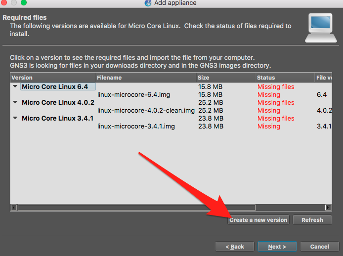

Manufacturers release new version of their appliance everyday. The GNS3 community not always know about this new releases and updated the appliance file. But GNS3 allow you to use unknow version of an appliance.

:::note
This version of the appliance are not tested and could not work in GNS3 don’t hesitate to share your feedbacks on the forum [https://gns3.com/community](https://gns3.com/community)
:::

## Create new version from the appliances wizard

Import the ```.gns3a``` file as usual. When GNS3 list all the version at appliance import click on Create a new version.



Give your version a name


And after that you can import your appliance disk


After that it’s work like any appliances.

## Contribute your changes
If you test a new version we encourage you to contribute your changes  to the community. You can do it by opening an issue on [https://github.com/GNS3/gns3-registry](https://github.com/GNS3/gns3-registry)
