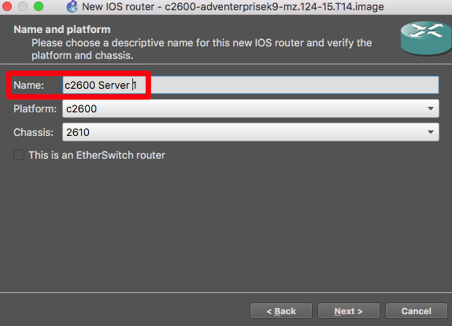
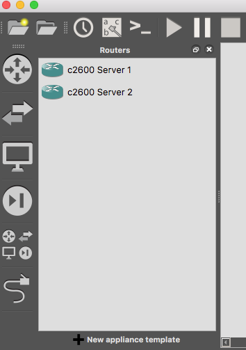

GNS3 itself doesn’t have limitation on the number of nodes you can run into it. The limitation will be your hardware.

## Run GNS3 on a remote server

If your local machine is not enough to let you create the sorts of topologies you want to use,  you can run GNS3 on a bigger machine locally or on a cloud Provider like Packet.

- See [Install on a remote server](installation/remote-server)
- See [GNS3 on packet.net](installation/packet)

## Split the load on multiple machine
In order to cross the limitation of your hardware, you can use multiple GNS3 servers for running the same topology.

An example is Jason C. Neumann running GNS3 in a Raspberry Pi cluster:
https://www.gns3.com/discussions/the-worlds-first-gns3-beowulf-cl

:::note
The PI use an ARM processor that is not adapted to run x86 code on Qemu. Also since this forum post, the interfaces have changed.
:::

## Requirements
- You need the same version of the GNS3 server on all machines
- All servers need to be on the same network . Nothing should prevent them from being able to communicate with each other

## Limitations
- A node need to be explicitly created on a server. There is no smart allocation
- You need to create an appliance template by server
- You can’t move a node from a server to another
- Portable projects are not supported

:::note
This is not definitive. GNS3 is evolving and contributions are welcome
:::

## Setup
### Add your remote servers
First you need to add your remote servers in the Server preferences:

You will see these appear in the Server summary pane, along with the CPU/RAM usage of each:

### Setup the Appliance Templates
When you create your appliance template, choose a remote server:

At the node name step, choose a name to help you remember which server this node will be run on:

Create a second template for the other server. You have now two nodes that allow you to manually dispatch the load between servers:

You can use the server summary in order to know which server has free resources:

